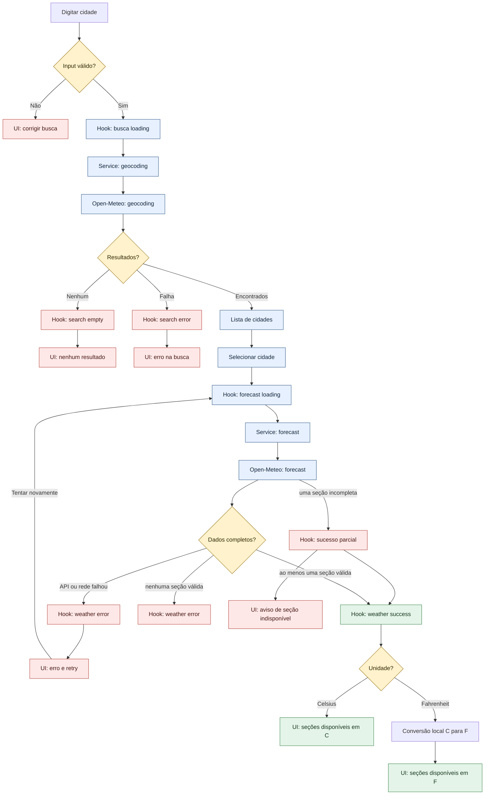

# Weather App — Plano Técnico

Este plano traduz [specs/weather-app-spec.md](../specs/weather-app-spec.md) em decisões técnicas e contratos. Ele não contém código de produção.

## Architecture

### Visão geral

A aplicação será uma SPA React estática com quatro camadas simples:

1. **Apresentação:** componentes React responsáveis por formulário, resultados, clima atual, previsão, unidade e estados visuais.
2. **Orquestração:** hook `useWeather`, que coordena busca, seleção, carregamento, sucesso, vazio, erro e retry.
3. **Dados:** services isolados para geocoding e forecast da Open-Meteo.
4. **Domínio compartilhado:** tipos e funções puras para conversão, formatação e mapeamento de códigos meteorológicos.

Os componentes não conhecerão URLs, parâmetros da API ou o formato bruto das respostas. O service converterá respostas externas em contratos internos antes de entregá-las ao hook.

### Responsabilidades e testabilidade

- **`components/` — apresentação:** renderiza props e emite eventos de intenção do usuário. Pode ser testado com Testing Library usando roles, labels, teclado e estados visuais, sem rede.
- **`hooks/` — orquestração/estado:** coordena chamadas, transições de status, seleção, concorrência e retry. Pode ser testado com services falsos para verificar comportamento sem depender de HTTP.
- **`services/` — acesso a dados:** monta requests, aplica timeout, valida payloads e normaliza respostas externas. Pode ser testado com `fetch` mockado e fixtures de sucesso, erro e resposta parcial.
- **`lib/` — funções puras:** converte temperatura, formata datas e mapeia códigos WMO. Pode ser testado com entradas e saídas determinísticas, incluindo fronteiras numéricas.
- **`types/` — contratos:** centraliza os formatos internos e reduz divergência entre camadas; a compilação strict verifica incompatibilidades.
- **`App.tsx` — composição:** conecta hook e componentes, sem conter regras de API ou transformação de dados. O teste E2E valida essa integração por comportamento.

Essa separação permite testar cada decisão no nível mais barato: funções puras em unitários, rede com mocks, estado com doubles e jornada completa apenas nos fluxos críticos.

### Princípios

- Celsius será a unidade interna canônica; Fahrenheit será derivado na apresentação.
- Uma cidade ficará em foco por vez.
- Não haverá store global, autenticação, backend ou persistência local.
- O fluxo principal será teclado-acessível e mobile-first.
- Cada requisito funcional será rastreado a critérios de aceite e testes.

### Rastreabilidade arquitetural

| Decisão | Requisitos relacionados |
| --- | --- |
| Busca e seleção separadas | FR-01, FR-02, AC-FR01-01, AC-FR02-01 |
| Dados internos normalizados em Celsius | FR-03, FR-04, FR-05, RNF8 |
| Estados explícitos e retry | FR-06, FR-07, RNF4, RNF6 |
| Layout responsivo e semântica acessível | RNF2, RNF3, US-05 |
| Fonte pública sem segredo | RNF5 |

## Tech Stack

| Tecnologia | Uso | Justificativa |
| --- | --- | --- |
| TypeScript strict | Tipos e contratos | Reduz erros entre API, service, hook e componentes. |
| React | Interface e composição | Já definido pela stack do projeto e adequado ao fluxo por estados. |
| Vite | Build e desenvolvimento | Build estático simples e compatível com deploy em GitHub Pages. |
| Tailwind CSS | Estilos responsivos | Implementa mobile-first e o tema dark glassmorphism definido nas instruções do projeto. |
| Open-Meteo | Geocoding e previsão | Fonte pública, sem chave de API, conforme RNF5. |
| Vitest + Testing Library | Testes unitários e de componentes | Cobrem funções puras, services e comportamento acessível da UI. |
| Playwright | Testes E2E | Valida jornada completa, erros e viewport de 320px. |
| Biome | Lint e formatação | Mantém consistência no código TypeScript/React existente. |
| pnpm | Dependências e scripts | Gerenciador já adotado pelo repositório. |

Não será introduzido Redux, React Query ou um backend: o volume e a duração do estado não justificam essas camadas no MVP.

## Project Structure

```text
src/
├── components/
│   ├── SearchBar.tsx          # input, submit, validação e acessibilidade
│   ├── CityResults.tsx        # resultados e seleção de cidade
│   ├── CurrentWeather.tsx     # clima atual
│   ├── ForecastList.tsx       # cinco dias
│   ├── ForecastCard.tsx       # item de um dia
│   ├── UnitToggle.tsx         # Celsius/Fahrenheit
│   └── states/                # idle, loading, empty e error
├── hooks/
│   └── useWeather.ts          # orquestração do fluxo e retry
├── services/
│   ├── geocodingService.ts    # Open-Meteo geocoding
│   └── weatherService.ts      # Open-Meteo forecast
├── lib/
│   ├── temperature.ts         # conversão e arredondamento
│   ├── format.ts              # datas, números e unidade
│   └── weatherCodes.ts        # WMO code -> label/ícone semântico
├── types/
│   └── weather.ts             # contratos internos e estados
├── styles/
│   └── index.css              # Tailwind e estilos globais mínimos
├── App.tsx                    # composição da tela
└── main.tsx                   # bootstrap React
tests/
├── unit/                      # funções, services, hooks e componentes
└── e2e/                       # jornadas com API interceptada
```

Os nomes acima são a estrutura-alvo; os arquivos podem ser agrupados apenas quando isso reduzir duplicação sem misturar responsabilidades.

### Regras de dependência

```text
App -> components + hooks
hooks -> services + lib + types
services -> lib + types
components -> lib + types
lib -> types (quando necessário)
```

`components` não importa `services` diretamente, `services` não importa componentes e `lib` não conhece React. Isso mantém a UI substituível, a rede mockável e as funções de domínio independentes do ambiente do navegador.

## Data Model

Os contratos internos abaixo são a fonte de verdade entre services, hook e UI. Os campos de temperatura terminados em `C` permanecem em Celsius mesmo quando a UI estiver em Fahrenheit.

```ts
type Unit = 'celsius' | 'fahrenheit' // unidade exibida ao usuário

interface City {
  id: number // identificador estável do resultado de geocoding
  name: string // nome da cidade
  country?: string // país da cidade, quando fornecido pelo geocoding
  admin1?: string // estado, província ou região, quando disponível
  latitude: number // latitude em graus decimais
  longitude: number // longitude em graus decimais
  timezone?: string // fuso horário IANA retornado pela fonte
}

interface WeatherCondition {
  code: number // código WMO retornado pela Open-Meteo
  label: string // descrição em pt-BR para a interface
}

interface CurrentWeather {
  time: string // timestamp local da cidade em ISO 8601
  temperatureC: number // temperatura atual em Celsius
  condition: WeatherCondition // condição meteorológica atual
}

interface ForecastDay {
  date: string // data local da cidade em YYYY-MM-DD
  temperatureMinC: number // mínima do dia em Celsius
  temperatureMaxC: number // máxima do dia em Celsius
  condition: WeatherCondition // condição predominante do dia
}

interface WeatherData {
  city: City // cidade usada na consulta
  timezone: string // fuso efetivamente usado pela resposta
  current?: CurrentWeather // clima atual, ausente se a seção vier incompleta
  forecast?: ForecastDay[] // cinco dias completos; ausente se a seção vier incompleta
}

type AsyncStatus = 'idle' | 'loading' | 'success' | 'empty' | 'error'

interface SearchState {
  status: AsyncStatus
  query: string
  results: City[]
  message?: string
}

interface WeatherState {
  status: AsyncStatus
  data?: WeatherData
  message?: string
}
```

### Contratos de service

```ts
interface GeocodingService {
  searchCities(query: string, signal?: AbortSignal): Promise<City[]>
}

interface WeatherService {
  getWeather(city: City, signal?: AbortSignal): Promise<WeatherData>
}
```

### Regras do modelo

- `City.id`, latitude e longitude identificam a cidade selecionada; o texto do input não é usado como identidade.
- Se `WeatherData.forecast` estiver presente, terá exatamente cinco dias completos conforme FR-04.
- Current e forecast são validados independentemente; uma resposta parcial pode preservar a seção completa.
- Se país não vier no geocoding, a UI usa os demais dados de localização disponíveis e não inventa um país.
- Uma seção sem campos essenciais não é renderizada; nenhum valor meteorológico é inventado.
- A conversão para Fahrenheit e o arredondamento para inteiro ocorrem fora do modelo bruto, na camada de apresentação/lib.

## Data Flow



### Sequência principal

1. `SearchBar` valida input vazio, espaços e mínimo de 2 caracteres.
2. O hook define `search.status = loading` e chama `GeocodingService` com `AbortSignal`.
3. O service consulta a Open-Meteo, valida a resposta e retorna até 10 `City`.
4. O usuário seleciona um `City` por identificador estável.
5. O hook define `weather.status = loading` e chama `WeatherService` uma vez.
6. O service normaliza clima atual, timezone e cinco dias.
7. A UI renderiza dados em Celsius; a unidade escolhida transforma apenas a apresentação.
8. Uma nova busca ou seleção invalida a resposta anterior para evitar dados obsoletos.

## External APIs

### Geocoding

**Endpoint:** `GET https://geocoding-api.open-meteo.com/v1/search`

**Parâmetros:**

| Parâmetro | Valor planejado | Regra |
| --- | --- | --- |
| `name` | texto do usuário | obrigatório, mínimo de 2 caracteres |
| `count` | `10` | máximo definido por FR-01 |
| `language` | `pt` | labels compatíveis com a UI pt-BR |
| `format` | `json` | resposta estruturada |

**Campos consumidos:** `id`, `name`, `latitude`, `longitude`, `country`, `admin1`, `timezone`.

O service deve tratar ausência de `results` como lista vazia, não como exceção.

**Exemplo resumido de resposta:**

```json
{
  "results": [
    {
      "id": 3451190,
      "name": "Sao Paulo",
      "latitude": -23.55,
      "longitude": -46.63,
      "country": "Brazil",
      "admin1": "Sao Paulo",
      "timezone": "America/Sao_Paulo"
    }
  ]
}
```

**Mapeamento para `City`:** `id`, `name`, `country`, `admin1`, `latitude`, `longitude` e `timezone` são copiados para o contrato interno. O service pode normalizar labels de país/região para pt-BR, mas não deve alterar coordenadas ou o identificador.

### Forecast

**Endpoint:** `GET https://api.open-meteo.com/v1/forecast`

**Parâmetros:**

| Parâmetro | Valor planejado | Regra |
| --- | --- | --- |
| `latitude` | latitude da `City` | obrigatório |
| `longitude` | longitude da `City` | obrigatório |
| `current` | `temperature_2m,weather_code` | dados atuais mínimos |
| `daily` | `weather_code,temperature_2m_max,temperature_2m_min` | previsão mínima |
| `timezone` | `auto` | datas no fuso da cidade |
| `forecast_days` | `5` | hoje + quatro dias |
| `temperature_unit` | `celsius` | Celsius canônico interno |

**Campos consumidos:**

- `timezone`;
- `current.time`, `current.temperature_2m`, `current.weather_code`;
- `daily.time`, `daily.temperature_2m_min`, `daily.temperature_2m_max`, `daily.weather_code`.

O service deve validar current e daily independentemente, conferindo tipos e datas. Uma seção completa pode ser mapeada mesmo se a outra estiver ausente ou incompleta. A resposta deve ser transformada em `WeatherData`; componentes não devem consumir o payload bruto.

**Exemplo resumido de resposta:**

```json
{
  "timezone": "America/Sao_Paulo",
  "current": {
    "time": "2026-09-30T10:00",
    "temperature_2m": 22.4,
    "weather_code": 2
  },
  "daily": {
    "time": ["2026-09-30", "2026-10-01", "2026-10-02", "2026-10-03", "2026-10-04"],
    "temperature_2m_min": [16.1, 17.0, 18.2, 19.0, 18.4],
    "temperature_2m_max": [25.3, 26.0, 27.1, 28.0, 25.8],
    "weather_code": [2, 3, 61, 1, 80]
  }
}
```

**Mapeamento para os contratos internos:**

| Resposta Open-Meteo | Contrato interno | Regra |
| --- | --- | --- |
| `timezone` | `WeatherData.timezone` | Preservar o identificador IANA retornado. |
| `current.time` | `CurrentWeather.time` | Preservar o timestamp no fuso da cidade. |
| `current.temperature_2m` | `CurrentWeather.temperatureC` | Usar como Celsius porque `temperature_unit=celsius`. |
| `current.weather_code` | `CurrentWeather.condition.code` | Mapear o código WMO para label pt-BR em `condition.label`. |
| `daily.time[i]` | `ForecastDay.date` | Criar um item por índice, em ordem cronológica. |
| `daily.temperature_2m_min[i]` | `ForecastDay.temperatureMinC` | Usar o valor Celsius do mesmo índice. |
| `daily.temperature_2m_max[i]` | `ForecastDay.temperatureMaxC` | Usar o valor Celsius do mesmo índice. |
| `daily.weather_code[i]` | `ForecastDay.condition.code` | Mapear cada código WMO para label pt-BR. |
| `City` selecionada | `WeatherData.city` | Anexar a cidade que originou a consulta. |

O normalizador exige cidade e timezone válidos. `current` só é definido quando todos os campos mínimos atuais são válidos; `forecast` só é definido quando os arrays diários têm cinco posições válidas. Se uma seção falhar, preservar a outra e indicar a seção indisponível. Se ambas falharem, retornar erro. Valores Fahrenheit nunca serão solicitados à API; a conversão ocorre localmente conforme FR-05.

### Política de rede

- Usar `fetch` nativo ou helper pequeno equivalente, sem cliente HTTP adicional.
- Propagar `AbortSignal` para cancelar uma busca substituída por outra.
- Aplicar timeout de 10 segundos por request e classificar HTTP não-2xx, timeout, rede e payload inválido em erros internos distintos.
- Não enviar chave, token ou dado pessoal para a API.

## State Management

O estado viverá no hook `useWeather`, usado por `App` e distribuído por props. Não haverá store global. O hook manterá separadamente o estado da busca de cidades e o estado do forecast, pois uma busca pode estar vazia enquanto o clima anterior ainda está visível.

```ts
interface WeatherViewModel {
  search: SearchState
  weather: WeatherState
  unit: Unit
  selectUnit: (unit: Unit) => void
  searchCities: (query: string) => Promise<void>
  selectCity: (city: City) => Promise<void>
  retryWeather: () => Promise<void>
}
```

### Estado de busca

- `idle`: tela inicial sem resultados.
- `loading`: geocoding em andamento.
- `success`: resultados disponíveis para seleção.
- `empty`: resposta válida sem cidades.
- `error`: falha de rede, timeout, HTTP ou payload.

### Estado meteorológico

- `idle`: nenhuma cidade selecionada.
- `loading`: forecast em andamento.
- `success`: ao menos uma seção (`current` ou `forecast`) está completa; `message` informa a seção indisponível quando houver resposta parcial.
- `empty`: reservado para ausência de dados utilizáveis, sem inventar conteúdo.
- `error`: falha recuperável ou não recuperável.

O estado `error` deve ser usado quando nenhuma seção meteorológica puder ser exibida. Se apenas `current` ou `forecast` estiver válida, o estado é `success`, a seção completa é renderizada e a interface informa a indisponibilidade da outra.

### Unidade

`unit` começa em `'celsius'` e é mantida no estado local do hook. `selectUnit` apenas altera a unidade de apresentação; não chama services e não altera `WeatherData`.

Na renderização, componentes recebem valores derivados de `WeatherData`:

```text
temperatureDisplay = unit === 'celsius'
  ? round(current.temperatureC)
  : round(toFahrenheit(current.temperatureC))
```

O mesmo cálculo é aplicado a `temperatureMinC` e `temperatureMaxC` de cada `ForecastDay`. A conversão nunca substitui os valores Celsius armazenados, portanto alternar várias vezes não acumula erro e não dispara novo request.

### Transições permitidas

| Operação | Estado inicial | Estado seguinte |
| --- | --- | --- |
| Abrir aplicação | `search.idle`, `weather.idle` | mantém estado inicial |
| Buscar cidade válida | `search.idle` ou qualquer estado | `search.loading` → `search.success` ou `search.empty`/`search.error` |
| Selecionar cidade | `search.success` | `weather.loading` → `weather.success` ou `weather.error` |
| Alternar unidade | qualquer estado | mesmo status; somente `unit` muda |
| Retry de forecast | `weather.error` | `weather.loading` → `weather.success` ou `weather.error` |
| Nova busca | qualquer estado | cancela operação anterior e inicia `search.loading` |

### Concorrência

Cada nova busca aborta a requisição anterior usando `AbortController`. O hook ignora resultados e erros de operações cujo sinal já esteja abortado; não será mantido um contador paralelo de operações.

## Error Handling

### Classificação interna

```ts
type WeatherErrorKind =
  | 'network'
  | 'timeout'
  | 'http'
  | 'rate_limit'
  | 'invalid_payload'
  | 'partial_data'
```

Os services convertem falhas externas em `WeatherErrorKind`; componentes não tratam exceções de `fetch` diretamente. Input vazio, input curto e geocoding sem resultados são estados de validação/domínio, não falhas técnicas.

| Situação | Estado | Mensagem/ação | Dados preservados |
| --- | --- | --- | --- |
| Input vazio ou curto | validação local | Informar mínimo de 2 caracteres; sem request | query |
| Geocoding sem resultados | `search.empty` | “Nenhuma cidade encontrada.”; nova busca | query |
| Falha de geocoding | `search.error` | erro de conexão/serviço; retry pela nova busca | query |
| Forecast em andamento | `weather.loading` | indicador de carregamento | cidade |
| Timeout ou falha de rede | `weather.error` | “Não foi possível carregar o clima. Tente novamente.” | cidade |
| HTTP 429 ou indisponibilidade | `weather.error` | serviço temporariamente indisponível; retry manual | cidade |
| JSON inválido/contrato inesperado | validar cada seção | descartar apenas a seção inválida, se a outra estiver completa | cidade e seção válida |
| Uma seção parcial | `weather.success` | exibir a seção completa e avisar qual está indisponível | cidade e seção completa |
| Nenhuma seção meteorológica utilizável | `weather.error` | dados indisponíveis; oferecer retry | cidade |
| Retry com sucesso | `weather.success` | atualizar dados | cidade |
| Retry com nova falha | `weather.error` | manter retry disponível | cidade |

Erros técnicos não devem expor stack trace, URL completa ou detalhes internos ao usuário. O retry será manual e não haverá repetição automática agressiva.

## Testing Strategy

### Unitários — Vitest

- Conversão Celsius/Fahrenheit e arredondamento para inteiro.
- Formatação de datas usando timezone fornecido.
- Mapeamento de códigos WMO para condições conhecidas e fallback desconhecido.
- Validação de input vazio, espaços e mínimo de 2 caracteres.
- Normalização de respostas de geocoding e forecast.
- Validação de cinco dias e campos essenciais.
- Classificação de timeout, HTTP, rede, JSON inválido e rate limit.
- Transições do hook: `idle`, `loading`, `success`, `empty` e `error`.
- Retry com sucesso e retry com nova falha.

Services usarão mocks de `fetch`; nenhum teste unitário chamará a API real.

### Componentes — Testing Library

- Busca por role/label, submissão e validação local.
- Resultados distinguíveis e seleção por teclado.
- Renderização de sucesso com clima atual, cidade selecionada e cinco dias.
- Estado `loading` com indicador acessível e controles coerentes.
- Estado `error` com mensagem específica e ação de retry quando aplicável.
- Estado `empty` para busca sem resultados e estado inicial sem dados.
- Toggle de unidade sem nova chamada de rede.
- Foco visível e nomes acessíveis dos controles principais.
- Contraste WCAG AA: pelo menos 4.5:1 para texto normal e 3:1 para texto grande e componentes visuais relevantes, usando auditoria automatizada e revisão manual.

Cada componente de estado deve ser testado isoladamente e também na composição de `App`, verificando que a mudança de estado substitui o conteúdo correto sem exibir dados obsoletos.

### E2E — Playwright

Os endpoints serão interceptados com `page.route` para respostas determinísticas.

1. Busca cidade → seleção → clima atual e previsão de cinco dias.
2. Busca vazia, curta e sem resultados.
3. Cidades homônimas e seleção correta.
4. Alternância Celsius/Fahrenheit sem nova requisição meteorológica.
5. Falha, timeout e retry com sucesso.
6. Retry com nova falha.
7. Jornada completa em viewport de 320px e viewport desktop.
8. Navegação do fluxo principal apenas com teclado.
9. Resposta parcial: renderizar somente a seção completa e informar a seção indisponível.
10. Auditoria automatizada de contraste e acessibilidade WCAG AA básico.

### Verificação de performance

- Medir do início da navegação até a interface inicial utilizável com cache frio, viewport móvel intermediária e rede 4G simulada; o resultado deve ser inferior a 2 segundos.
- Medir da ação de busca até o feedback visual; o resultado deve ser de até 100ms.
- Executar as medições em perfil controlado e registrar separadamente o tempo de renderização e o tempo de resposta da API.

### Quality gates

Antes de considerar uma tarefa concluída: `pnpm lint`, `pnpm build` e `pnpm test`. O conjunto E2E deve ser executado antes da entrega quando o ambiente Playwright estiver disponível.

## Risks & Trade-offs

| Risco/decisão | Trade-off | Alternativa considerada | Decisão do plano |
| --- | --- | --- | --- |
| Dependência da Open-Meteo | Simplicidade e ausência de chave versus disponibilidade externa | Provedor com API key ou backend proxy | Isolar services, validar payloads e oferecer retry manual. |
| Sem cache ou persistência | Menos complexidade e privacidade melhor versus mais requests | `localStorage`, service worker ou React Query | Aceitar no MVP; não implementar cache local. |
| Estado em hook local | Simplicidade versus menor reutilização entre páginas | Redux, Context global ou Zustand | Adequado para uma única tela e uma cidade em foco. |
| Celsius interno + conversão local | Contrato simples versus necessidade de testar conversão | Solicitar Fahrenheit novamente à API | Adotar e cobrir com testes de fronteira. |
| `timezone=auto` | Datas corretas para a cidade versus dependência da resposta da API | Usar timezone do dispositivo | Exigir timezone válido no sucesso; não inventar timezone ausente. |
| Sem cliente HTTP adicional | Menos dependências versus menos helpers prontos | Axios ou cliente de dados completo | Usar `fetch` e um pequeno normalizador de erros. |
| Sem telemetria de usuário | Menor risco de privacidade versus menor visibilidade operacional | Analytics e error tracking de terceiros | Usar mensagens na UI, smoke checks e ownership explícito. |
| Suporte às duas versões mais recentes | Menor custo de testes versus não cobrir browsers antigos | Suportar versões antigas com polyfills | Validar Chrome, Edge, Firefox e Safari desktop/mobile definidos na spec. |
| Falha parcial de dados | Preserva informação válida versus menos conteúdo exibido | Descartar todo o payload ou renderizar cards incompletos | Validar current e forecast independentemente; exibir seção completa e avisar a indisponível. |
| Timeout da API | Evita espera indefinida versus interrupção de redes lentas | Aguardar indefinidamente ou configurar tempos diferentes | Aplicar timeout de 10 segundos por request e retry manual. |
| País ausente no geocoding | Contrato tolerante versus menos contexto de localização | Exigir país em todo resultado | Manter `country` opcional e exibir apenas os dados recebidos. |

### Pontos de atenção para o próximo backlog

- Confirmar a disponibilidade e o formato dos campos usados nos endpoints antes de implementar os services.
- Transformar os contratos deste plano em tarefas independentes, começando por tipos e funções puras.
- Não introduzir favoritos, geolocalização, cache, previsão horária ou qualquer item de `Out of Scope` sem nova decisão de produto.